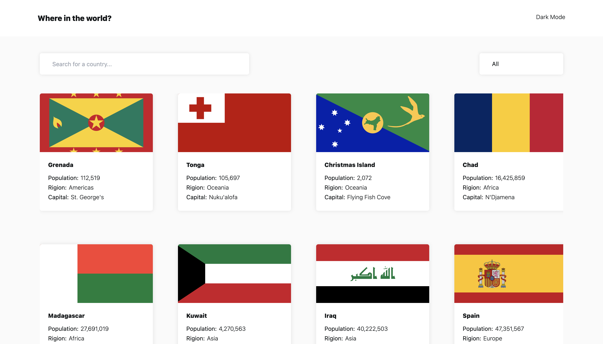
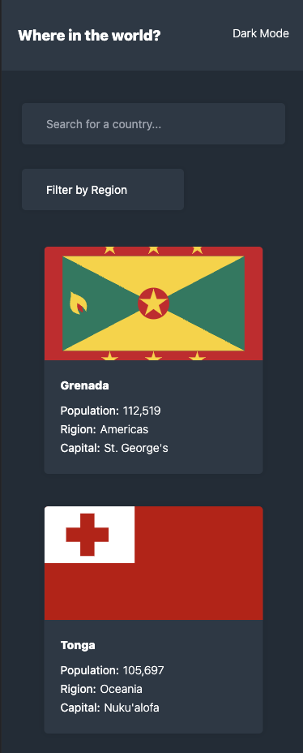

# Frontend Mentor - REST Countries API with color theme switcher solution

This is a solution to the [REST Countries API with color theme switcher challenge on Frontend Mentor](https://www.frontendmentor.io/challenges/rest-countries-api-with-color-theme-switcher-5cacc469fec04111f7b848ca). The challenge aims to build a web application that allows users to view countries' information, search for a specific country, filter countries by region, and toggle between light and dark color themes.

## Overview

Users should be able to:

- See all countries from the API on the homepage
- Search for a country using an `input` field
- Filter countries by region
- Click on a country to see more detailed information on a separate page
- Toggle the color scheme between light and dark mode

## Screenshot

## Links

- Live Site URL: https://where-are-we-in-the-world.netlify.app/

## Built with

- Flexbox
- CSS Grid
- [React](https://reactjs.org/) - JS library
- [Next.js](https://nextjs.org/) - React framework

## What I learned

While working on this project, I gained experience in several areas. Some of the key learnings include:

- Utilizing React and Next.js to build a dynamic and interactive web application.
- Working with APIs to fetch data and display it in the application.
- Handling user input and performing search functionality.

## Author

- Github: https://github.com/Emmyyyyyyy
